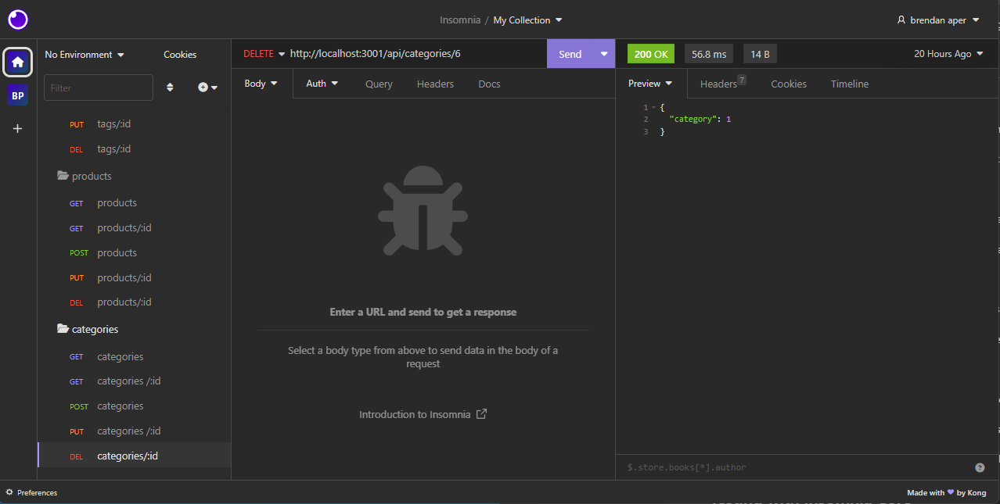

# E-commerce Back End Starter Code

[](https://opensource.org/licenses/MIT)

This README provides instructions on setting up and running a functional Express.js API integrated with Sequelize and MySQL. The API allows you to manage categories, products, and tags by performing CRUD operations.

## Prerequisites

Before running the API, make sure you have the following installed:

- Node.js
- MySQL server

## Setup

1. Clone this [repository](https://github.com/brendan-aper/E-Commerce-Back-End) to your local machine.

2. Install the required dependencies by running the following command in your terminal:

```
npm install
```

3. Create an environment variable file (`.env`) in the root directory of the project and add the following configuration:

```
DB_NAME = your_database_name
DB_USER = your_mysql_username
DB_PASS = your_mysql_password
```


Replace `your_database_name`, `your_mysql_username`, and `your_mysql_password` with your MySQL database name, username, and password respectively.

## Database Initialization

To create and seed the development database with test data, follow these steps:

1. Run the following command to create the database schema:

```
mysql -u root -p
```

2. After the schema is created, seed the database with test data by executing the following command:

```
npm run seed
```


## Starting the Server

To start the API server and sync the Sequelize models with the MySQL database, run the following command:

```
npm start
```

Once the server is running, you will see a message indicating that the API is up and running on a specific port (e.g., `http://localhost:3001`).

## API Endpoints

The following API endpoints are available:

- **GET /categories**: Retrieves all categories in JSON format.
- **GET /products**: Retrieves all products in JSON format.
- **GET /tags**: Retrieves all tags in JSON format.

- **POST /categories**: Creates a new category in the database.
- **POST /products**: Creates a new product in the database.
- **POST /tags**: Creates a new tag in the database.

- **PUT /categories/:id**: Updates the category with the specified ID.
- **PUT /products/:id**: Updates the product with the specified ID.
- **PUT /tags/:id**: Updates the tag with the specified ID.

- **DELETE /categories/:id**: Deletes the category with the specified ID.
- **DELETE /products/:id**: Deletes the product with the specified ID.
- **DELETE /tags/:id**: Deletes the tag with the specified ID.

## Testing with Insomnia Core

You can use Insomnia Core to test the API endpoints.

1. Download and install Insomnia Core from: [https://insomnia.rest/core/](https://insomnia.rest/core/)

2. Open Insomnia Core and create a new workspace.

3. Create requests for the API endpoints mentioned above, specifying the method (GET, POST, PUT, DELETE) and the appropriate URL (e.g., `http://localhost:3001/api/categories`, `http://localhost:3001/api/products`, `http://localhost:3001/api/tags`).

4. After setting up the requests, you can execute them to interact with the API and see the data in formatted JSON.




## Summary

Congratulations! You have successfully set up and run an Express.js API integrated with Sequelize and MySQL. Now you can manage categories, products, and tags by using the provided API endpoints. Enjoy building and testing your application with Insomnia Core! If you encounter any issues or need further assistance, feel free to refer to the documentation or reach out to the community for support. Happy coding!

## Questions

For questions you can contact me at my [email](mailto:brendanaper@gmail.com)
Feel free to follow me on [GitHub](https://github.com/brendan-aper)

## License

This Project is licensed under the MIT license
